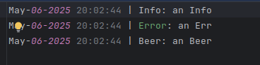

# LightLogger

A stupid and brutal PHP **logger system**
Orignally found in gist <a href="https://gist.github.com/kevinchappell/09130ee9036f5954ac8f">kevinchappell</a><br><br>
<br>

## Requirements

- PHP 7.4+



## Installation

```
composer require osd84/lightlogger
```

## Usage

```php
<?php
use osd84\LightLogger\Logger;
use osd84\LightLogger\NoLogger;

define('ROOT', dirname(__FILE__, 2));

require dirname(__DIR__) . '/vendor/autoload.php';

// if want log
$log = new Logger(ROOT . '/logs/', 'myapp.log');
$log->info('an Info'); // May-13-2022 10:34:57 | Info: an Info
$log->error('an Err'); // May-13-2022 10:34:57 | Error: an Err
$log->beer('an Beer'); // May-13-2022 10:34:57 | Beer: an Beer

// if want silent Log
$log = new NoLogger();
$log->info('an Info'); // null
$log->error('an Err'); // null
$log->beer('an Beer'); // null

// Why, because some time you need silent log simply ?
$debug = false;
if($debug) {
    $log = new Logger(ROOT . '/logs/')
} else {
    $log = new NoLogger();
}
$log->info('Log is Disabled') // null

$debug = true;
if($debug) {
    $log = new Logger(ROOT . '/logs/')
} else {
    $log = new NoLogger();
}
$log->info('Log is Enabled') // May-13-2022 10:34:57 | Info: Log is Enabled
```

## Tests

Simple Tests by running <br>

```sh
php tests/run.php
```